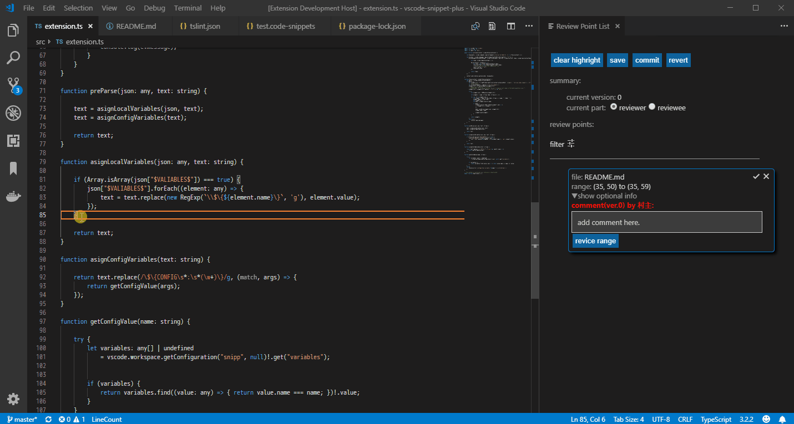

# vscode-review

vscodeでコードレビューを効率的に実施するための拡張機能です。



## 機能
---

### 指摘の追加
---

エディタで指摘箇所を選択し，右クリックコンテキストメニューの"Add Review Point"をクリックすると
選択箇所が指摘ポイントとして追加されます。

### 指摘の表示（レビュー管理画面）
---
コマンドパレットで`Show Review Point`コマンドを入力し，レビュー管理画面を開きます。
レビュー管理画面は指摘の追加時にも自動で表示されます。

### レビュー管理画面の操作
---
#### レビューの開始
開始に操作は必要ありませんが，"current part"チェックボックスでであなたがレビュー者かコーダのどちらであるか選択してください。

#### レビューの中断
レビューを中断する場合はsaveボタンを押してください。
現在のワークスペースのルート下の`.vscode`フォルダに`vscode-review.json`ファイルが出力され，現在の状態が保存されます。（※すでにある場合は上書きされます！）

#### レビューの完了
レビューが完了したら，commitボタンを押してください。
レビューバージョンが更新され，各指摘ポイントに返信欄が追加されます。
commit直前の状態に戻したいときは，revertボタンを押してください。

#### レビュー指摘の修正
各指摘ポイントの左上のほうをクリックすると，指摘箇所のコードにジャンプします。
指摘を修正し，コードが変わったら，直した部分を再び範囲選択し，指摘ポイントのrevice rangeボタンを押すことで，範囲が更新されます。
すべての修正が完了したら，commitしてください。

#### 修正のチェック
修正確認が終わったら，対応する指摘ポイントの右上のチェックマークでクローズしてください。
不承知の場合はクローズせず，コメントを記入してください。
以降はレビュー者とコーダでcommitを繰り返していきます。

### 指摘ポイント追加情報
---
指摘ポイントに保存するデータを追加できます。
詳細はパワー不足により割愛。

### DR記録への変換
---
レビュー結果を従来のDR記録に変換します。
これもパワー不足により割愛。

## コマンド
---

- `review.showReviewPoints`：レビュー管理画面を表示
- `review.convert`：DR記録へ変換する

## 設定
---
- `review.locale`: 言語設定（日本語or英語）
- `review.username`: 指摘or返信者の名前（デフォルトはOSのユーザ名）
- `review.commitMessageTemplete`: デフォルトのコミットメッセージ

## 対応予定
---

### 複数のDR者によるレビュー
複数のDR者による指摘結果をまとめて表示できるようにする予定


## リリースノート
---

### 0.0.1

プロトタイプ初回リリース

### 0.0.2

DR記録への変換機能を追加

### 0.0.3

- GUIを改良
- レビュー結果のフィルタリングに対応
- レビュー結果の削除前に確認ダイアログを表示するようにした
- 指摘をクローズしたバージョンであればアンクローズできるようにした

### 0.0.4

- コミットメッセージに対応<br/>
    以下の設定でデフォルトのフォーマットを設定できる
    ```
    review.commitMessageTemplete
    ```
    設定例）
    ```
    "review.commitMessageTemplete": "Doc Ver:\n実施日:\nDR形態:\nチェック者:\n設計工数(hr):\nDR工数:\n修正工数:",
    ```
- 以下の設定にて日本語・英語を切替えできるようにした
    
    ```
    review.locale
    ```   
- レビュー管理画面でctrl + sを押すとセーブできるようにした
- GUIをシンプル化


---

Happy working!<br>
Muraak.

