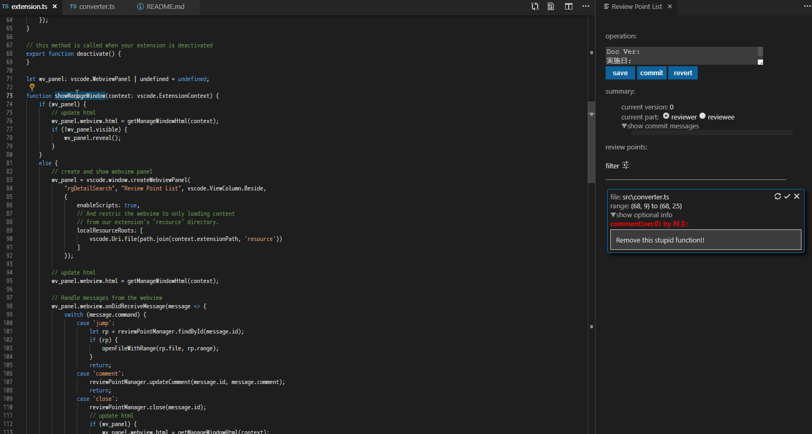

# vscode-review

vscodeでコードレビューを効率的に実施するための拡張機能です。



## 使い方

- 指摘対象をVSCodeで開く

    指摘対象のソースコードプロジェクトのルートディレクトリを
    ワークスペースとして、VSCodeを開いてください。

- レビュー管理画面(Review Point List)を開く

    コマンドパレットで`Show Review Point`コマンドを入力し，レビュー管理画面を開きます。
    レビュー管理画面は指摘の追加時にも自動で表示されます。

- 指摘の追加
    
    エディタでソースコードの指摘箇所を選択し，
    右クリックコンテキストメニューの`Add Review Point`をクリックすると
    選択箇所が指摘ポイントとしてレビュー管理画面(Review Point List)に
    追加されます。

- 指摘ポイントの操作

    レビュー管理画面(Review Point List)に追加された指摘ポイントでは
    以下の操作ができます。
    後述のオプション情報を追加している場合、`▼オプション情報を表示`を展開し、
    記入してください。

    - 指摘内容の記入
    - 指摘箇所へのジャンプ
    - 指摘範囲の修正
    - 指摘ポイントのクローズ
    - コミットの取戻し

- 指摘一覧の一時保存

    レビュー管理画面(Review Point List)の上部にある`保存`ボタンを押すと、現在の指摘内容が
    ワークスペースルートにある`.vscode`ディレクトリ内に`vscode-review.json`というファイルで
    保存されます。
    
    **!!注意!!**:指摘内容を保存しないまま、VSCodeを終了した場合、指摘内容は消えてしまいます。

- レビューのコミット

    レビューがひととおり完了したら、レビュー管理画面(Review Point List)で
    以下を実施してください：

    - `現在の担当`ラジオボタンで自分が`指摘者`か`コーダ`のどちらであるかを選択

    - `操作:`グループの上部にコミットメッセージを入力

    - `操作:`グループの`コミット`を押下

    コミット後は、`現在の担当`が入れ替わり、各指摘ポイントに返信欄が追加されます。
    また、 ワークスペースルートにある`.vscode`ディレクトリ内の
    `vscode-review.json`ファイルに内容が保存されます。

- 受け渡し

     `.vscode`を含むプロジェクトディレクトリを
     次の担当者へ受け渡して(コピーして)ください。
     両者が同じ内容のソースプロジェクトを所持している場合は、
     `.vscode`ディレクトリをコピーするだけでも指摘情報を受け渡すことができます。

## その他の特徴

### オプション情報の定義

本エクステンションディレクトリの`configuration`ディレクトリに`optionalFormat.json`
ファイルを追加することで、指摘ポイントにプルダウンメニューやチェックボックスなどの
選択記入項目を追加することができます。
`optionalFormat.json`は以下のようなフォーマットで記入してください:

```[json]
// コメントはjson文法ではありませんが便宜上使用しています。
[
    // 追加したい情報をこの配列の要素として追加してください
    { 
        // 以下は配列要素(1つのオプション情報)の設定内容です
        id: string, // このオプション情報のidを文字列で設定
        type: int,  // このオプション情報のタイプ(0: チェックボックス, 1: プルダウンメニュー) 
        name: string, // このオプション情報の表示名を文字列で設定
        defaultValue: any, // このオプションのデフォルト値を設定
        listValues: [ // typeが1:プルダウンメニューの場合のみ必要．選択肢を設定
            {name: string/*表示名*/, value: any/*データ値*/},...
        ], 
        enableWhen: { // このオプションを特定の条件でのみ入力可能にする設定
           target: string, // 条件の判定対象となるオプション情報のidを指定
            caseValues: array, // このオプション情報が有効となるtargetの設定値を配列で指定
        }

    }
]
```


### 指摘情報の変換

指摘情報が格納された`vscode-review.json`ファイルを入力として
外部ツール(コンバータ)で指摘情報をその他の形式(e.g. excel)に
変換する作業をVSCodeのコマンドで実施できるようにしています。
VSCodeのコマンドパレットで`review.convert`コマンドを実行すると
`review.converter.converterPath`で指定されたコンバータが以下の
コマンド引数で実行されます。
コンバータは各自で作成いただく必要があります。

```
コンバータ [vscode-review.jsonファイルのパス] [出力先ディレクトリパス]
```

## コマンド
---

- `review.showReviewPoints`：レビュー管理画面を表示
- `review.convert`：DR記録へ変換する

## 設定
---
- `review.locale`: 言語設定（日本語or英語）
- `review.username`: 指摘or返信者の名前（デフォルトはOSのユーザ名）
- `review.commitMessageTemplete`: デフォルトのコミットメッセージ
- `review.converter.converterPath`: コンバータのパス

## 対応予定
---

### 複数のDR者によるレビュー
複数のDR者による指摘結果をまとめて表示できるようにする予定


## リリースノート
---

### 0.0.1

プロトタイプ初回リリース

### 0.0.2

DR記録への変換機能を追加

### 0.0.3

- GUIを改良
- レビュー結果のフィルタリングに対応
- レビュー結果の削除前に確認ダイアログを表示するようにした
- 指摘をクローズしたバージョンであればアンクローズできるようにした

### 0.0.4

- コミットメッセージに対応<br/>
    以下の設定でデフォルトのフォーマットを設定できる
    ```
    review.commitMessageTemplete
    ```
    設定例）
    ```
    "review.commitMessageTemplete": "Doc Ver:\n実施日:\nDR形態:\nチェック者:\n設計工数(hr):\nDR工数:\n修正工数:",
    ```
- 以下の設定にて日本語・英語を切替えできるようにした
    
    ```
    review.locale
    ```   
- レビュー管理画面でctrl + sを押すとセーブできるようにした
- GUIをシンプル化

### 0.0.5

- READMEを整理

- npmの脆弱性修正

- その他の軽微な修正

---

Happy working!<br>
Muraak.

